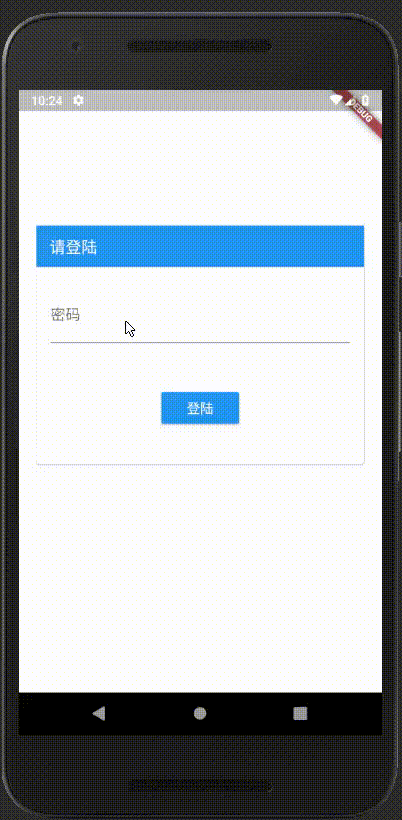

InfoManger
===

一个非常小的信息管理工具，会对保存的信息进行加密，可以将加密后的信息保存到 `OneDrive`，
也可以从 `OneDrive` 还原，使用 `Flutter` 开发，目前只支持 `Android`。

截图
---



GooglePlay
---
> 已经上传到 `GooglePlay`，地址是 [GooglePlay](https://play.google.com/store/apps/details?id=cqmyg.asdq.infomanager)

开发的目的
---

> 因为我们现在有太多的帐号，要全部记住的话太困难，所以写一个工具进行保存，还可以学习一下 `Flutter`。

特点
---

1. 本应用不保存加密信息的密码，所以您必须牢记您的密码。
2. 可以将加密后的信息备份到 `OneDrive`， 也可以从 `OneDrive` 还原，避免信息丢失。
3. 多语言支持

登录过程
---

1. 登录的时候先检查应用目录下是否有加密后的信息文件，如果信息文件不存在则直接进入应用。
2. 如果发现有信息文件则会使用你输入的密码，则尝试解密，如果解密成功则进入应用否则密码不正确无法进入应用。

安装
---

1. 搭建 [Flutter](https://flutter.io/get-started/install/) 的开发环境
2. 克隆项目 `git clone https://github.com/zhangtasdq/InfoManager-flutter.git`
3. 安装依赖包

```shell
flutter packages get

```
4. 添加 [keystore](https://flutter.io/android-release/#create-a-keystore)

5.运行

```
flutter run
```

OneDrive
---

1. 在[这里](https://dev.onedrive.com/app-registration.htm#register-your-app-for-onedrive)注册 `App` 获取 `clientid`。
2. 将获得的 `clientid` 写入 `lib/configure/app_configure.dart#ONE_DRIVE_CLIENT_ID`
3. 注册 [Microsoft](https://account.microsoft.com) 帐号
4. 重新运行程序

最后
---
>我只是初次学习 `flutter`，很多东西不熟悉，如果有什么地方有问题希望您能告诉我，谢谢!

>如果您有什么意见或者建议请您告诉我，谢谢! :)